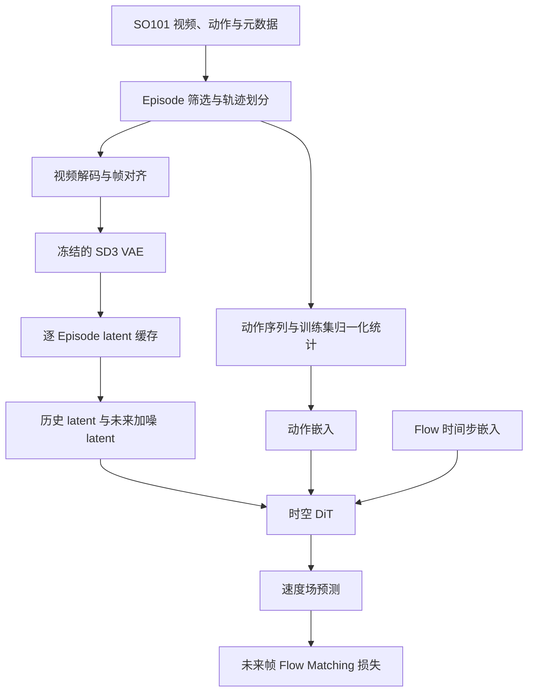

# SO101 World Model

<div align="center">

**基于 DiT 与 Flow Matching 的 SO101 动作条件世界模型**

机器人视频 · 潜空间建模 · 多 Episode 训练 · 动作干预评估

[项目介绍](#项目介绍) · [系统架构](#系统架构) · [数据流程](#数据流程) · [快速开始](#快速开始) · [评估方法](#评估方法)

</div>

---

## 项目介绍

本项目面向 SO101 机械臂轨迹，探索如何利用历史视觉观测与动作序列，学习机器人环境在潜空间中的动态变化。项目采用预训练 VAE 编码前视相机视频，以动作条件时空 DiT 预测 Flow Matching 速度场，并通过真实动作、错配动作和零动作之间的损失差异，检查模型是否利用了动作信息。

当前实现包含数据筛选、视频与动作对齐、潜空间缓存、多 Episode 训练和动作干预评估，适合用于机器人世界模型的原型实验。

### 核心实现

- **动作条件时空 DiT**：结合帧内空间注意力与因果时间注意力，通过动作和 Flow 时间步嵌入调制 Transformer。
- **离线潜空间缓存**：使用 SD3 VAE 编码视频帧，保存 latent、动作、状态和时间戳，训练时复用缓存。
- **Episode 级数据划分**：训练集与验证集按完整轨迹分离，时间窗口不跨 Episode。
- **训练集动作归一化**：动作统计量仅由训练 Episode 计算，验证和评估复用同一份统计量。
- **动作干预评估**：固定视觉输入与噪声条件，仅替换未来动作，比较配对损失差异。

> 当前公开代码主要覆盖离线训练与评估。仓库尚未提供未来视频采样、机器人规划控制或实机部署的完整入口。

## 系统架构



DiT 在每个时空块中依次执行空间注意力与因果时间注意力。历史帧提供视觉条件，动作嵌入与时间步嵌入共同进入条件调制模块。

| 模块 | 实现 |
| --- | --- |
| 数据加载与动作统计 | [multi_episode_dataset.py](src/data/multi_episode_dataset.py) |
| 时间窗口采样 | [temporal_sampler.py](src/data/temporal_sampler.py) |
| 动作嵌入 | [action_embedder.py](src/models/action_embedder.py) |
| 时空注意力 | [attention.py](src/models/attention.py) |
| DiT 主干 | [dit.py](src/models/dit.py) |
| Flow Matching 与损失掩码 | [flow_matching.py](src/diffusion/flow_matching.py) |

## 数据流程

数据来源为 [armnet/armnetbench_v01_lerobot_so101](https://huggingface.co/datasets/armnet/armnetbench_v01_lerobot_so101)。项目使用已发布的 LeRobot 格式数据，读取前视相机 `observation.images.front` 与 6 维动作；当前仓库不包含遥操作采集程序。

1. **读取轨迹元数据**：从 `meta/episodes/**/*.parquet` 读取 Episode、任务和视频分片信息。
2. **构建 Pilot 数据集**：默认以 Episode 0 为参考，选择同任务的前 10 条轨迹，前 8 条用于训练，后 2 条用于验证。若缺少任务字段，脚本会提示并退回到按编号选择前 10 条。
3. **下载必要视频分片**：根据元数据解析前视视频位置，对共享 MP4 分片去重后下载。
4. **视频与表格对齐**：按 Episode 时间范围解码视频，检查视频帧数与 Parquet 记录数一致。
5. **生成 latent 缓存**：短边缩放与中心裁剪至 `256 × 256`，归一化至 `[-1, 1]`，经 VAE 编码为 `16 × 32 × 32` latent。VAE 使用后验采样并固定逐 Episode 随机种子。
6. **计算动作统计量**：仅使用训练轨迹计算均值和标准差，供训练与验证共同使用。
7. **构建时间窗口**：每个窗口包含 10 个时间槽，前 2 个为历史条件，后 8 个参与训练损失；多 Episode 脚本默认采样间隔为 4 帧。

## 训练方法

模型采用线性插值的 Flow Matching。对未来 latent (z) 与高斯噪声 (\epsilon)，构造：

```math
z_\tau = (1-\tau)z + \tau\epsilon, \qquad
u = \epsilon-z
```

模型根据加噪 latent、时间步和动作序列预测速度场。损失只计算未来时间槽：

```math
\mathcal{L}
= \operatorname{MSE}_{t\geq H}
\left(v_\theta(z_\tau,\tau,a),\epsilon-z\right),
\qquad H=2
```

历史 latent 保持干净，历史位置的 Flow 时间步为 0。训练脚本使用 AdamW，周期验证采用固定噪声种子和均匀选取的固定窗口，训练结束后再评估全部验证窗口。

### 多 Episode 默认配置

| 参数 | 默认值 |
| --- | --- |
| DiT hidden size / depth / heads | 384 / 12 / 6 |
| Latent channels / patch size | 16 / 2 |
| 动作维度 | 6 |
| 窗口长度 / 历史帧数 | 10 / 2 |
| Frame skip | 4 |
| Batch size | 1 |
| 学习率 / weight decay | `1e-4` / `0` |
| 训练步数 | 4,000 |
| 验证间隔 / 固定验证窗口上限 | 250 步 / 128 |
| 训练 / 验证随机种子 | 0 / 12345 |

以上值对应 [train_multi_episode.py](scripts/train_multi_episode.py)。该脚本使用内部配置和 CLI 参数；`configs/*.yaml` 用于另一个基础训练入口，修改 YAML 不会自动改变多 Episode 训练。

## 快速开始

以下命令均从仓库根目录执行。实际数据缓存、训练和动作评估需要 CUDA GPU；VAE 缓存使用 BF16。仓库未提供完整环境锁定文件，下面给出一组安装示例，依赖版本应在自己的环境中验证并记录。

### 1. 配置环境

```bash
git clone https://github.com/chenfeiyi076-boop/so101_world_model.git
cd so101_world_model

conda create -n so101-wm python=3.10 -y
conda activate so101-wm

# 示例：PyTorch 2.2 + CUDA 11.8
pip install torch==2.2.0 --index-url https://download.pytorch.org/whl/cu118
pip install -r requirements.txt
pip install "numpy<2" pandas pyarrow av "diffusers==0.30.3" huggingface_hub safetensors

export PYTHONPATH="$PWD"
```

`requirements.txt` 当前只列出 PyYAML；数据和 VAE 管线还需要上述额外依赖。缓存脚本默认加载 [SD3 Medium 的 VAE](https://huggingface.co/stabilityai/stable-diffusion-3-medium-diffusers)，请先取得该模型的访问权限，并使用自己的 Hugging Face 账号登录。

### 2. 验证基础训练入口

```bash
python scripts/train.py --config configs/debug.yaml --device cpu --steps 2
```

该入口使用合成数据检查模型前向、损失与反向传播，不代表 SO101 数据实验结果。

### 3. 下载表格数据并选择轨迹

先下载元数据和动作表格，视频由 Pilot 脚本按需下载：

```bash
python - <<'PY'
from huggingface_hub import snapshot_download

snapshot_download(
    repo_id="armnet/armnetbench_v01_lerobot_so101",
    repo_type="dataset",
    revision="main",
    local_dir="data/armnet_so101_sample_tabular",
    allow_patterns=["meta/**", "data/**"],
)
PY

python scripts/prepare_multi_episode_pilot.py
```

轨迹划分保存至 `data/multi_episode_pilot/manifest.json`。数据集使用 `main` 修订；正式实验建议记录实际数据修订号。

### 4. 缓存 latent 并检查数据

```bash
python scripts/cache_multi_episode_latents.py --batch-size 8
python scripts/inspect_multi_episode_dataset.py
```

检查脚本同时生成训练集动作统计量：

| 产物 | 路径 |
| --- | --- |
| Latent 缓存清单 | `data/latent_cache/so101_front/multi_episode_manifest.json` |
| 训练集动作统计量 | `data/multi_episode_pilot/action_stats_absolute.pt` |

### 5. 训练

```bash
python scripts/train_multi_episode.py \
  --frame-skip 4 \
  --steps 4000 \
  --batch-size 1 \
  --lr 1e-4 \
  --val-every 250 \
  --val-windows 128
```

默认输出：

- `checkpoints/multi_ep_dit_s_fm_stride4_abs_sampled_best.pt`
- `checkpoints/multi_ep_dit_s_fm_stride4_abs_sampled_last.pt`

Checkpoint 保存模型、优化器、动作统计量、数据划分和训练配置，便于追踪实验设置。

### 6. 动作干预评估

```bash
python scripts/evaluate_multi_episode_action.py \
  --checkpoint checkpoints/multi_ep_dit_s_fm_stride4_abs_sampled_best.pt \
  --frame-skip 4 \
  --noise-draws 4 \
  --windows-per-episode 64
```

训练和评估的 `frame-skip` 应保持一致。数据路径、VAE 模型与窗口长度等部分设置仍在脚本中定义，迁移数据时需同步修改对应常量。

## 评估方法

评估脚本在验证轨迹上选取窗口，对每个窗口复用相同的视觉 latent、Flow 时间步与噪声，并只干预未来动作：

| 条件 | 操作 | 检查目的 |
| --- | --- | --- |
| True action | 使用真实动作序列 | 基准损失 |
| Mismatched action | 将未来动作替换为同 Episode 的另一窗口动作 | 检查时序错配是否影响预测 |
| Zero action | 将归一化后的未来动作设为 0 | 检查失去变化的动作条件是否影响预测 |

归一化后的零动作对应训练集均值，不能直接解释为机器人停止动作。脚本中的 `shuffle` 指同 Episode 的窗口错配，不是随机打乱单个时间步。

输出包括 `D_true`、`D_shuffle`、`D_zero`、配对损失差、相对差距及窗口级近似 95% 置信区间。相邻窗口可能相关，因此窗口级区间不等同于独立 Episode 级统计结论。


## 开发检查

```bash
pip install -r requirements-dev.txt
pytest -q tests/test_attention.py tests/test_dataset.py tests/test_flow_matching.py tests/test_model.py
```

以上命令运行注意力、合成数据集、模型前向与 Flow Matching 测试。另有 `tests/test_cached_dataset.py`，依赖固定缓存路径 `data/latent_cache/so101_front/episode_000.pt`，并假定轨迹包含 510 帧；运行前需核对本地缓存与这一假设。

## 项目结构

| 路径 | 用途 |
| --- | --- |
| `configs/` | 基础训练与调试配置 |
| `scripts/prepare_multi_episode_pilot.py` | 筛选轨迹与下载视频 |
| `scripts/cache_multi_episode_latents.py` | 视频到 latent 缓存 |
| `scripts/inspect_multi_episode_dataset.py` | 数据检查与动作统计 |
| `scripts/train_multi_episode.py` | 多 Episode 训练 |
| `scripts/evaluate_multi_episode_action.py` | 动作干预评估 |
| `src/data/` | 数据集与时间采样 |
| `src/models/` | 动作嵌入、注意力与 DiT |
| `src/diffusion/` | Flow Matching |
| `tests/` | 模块测试 |

`scripts/cache_latents.py`、`scripts/evaluate.py`、`scripts/inspect_batch.py` 和 `configs/pilot_fm.yaml` 当前为空文件，实际运行请使用上面列出的多 Episode 入口。

